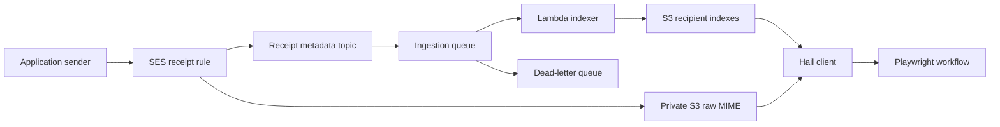
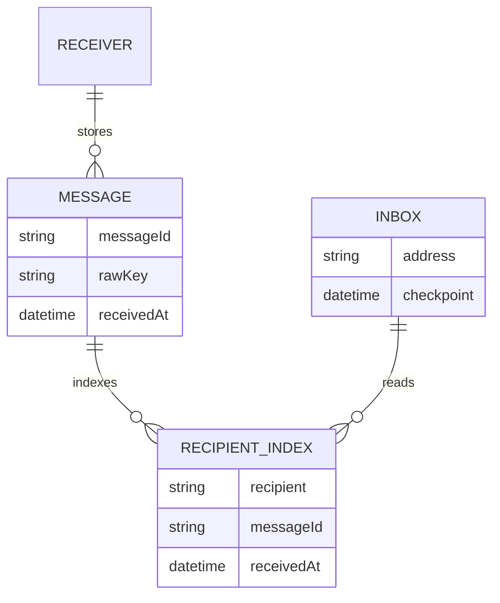

# Receipt and workflow architecture

Hail receives test mail in the user's AWS account. The application keeps its
existing sending provider. Extraction parses messages without visiting links;
a browser test explicitly follows an approved link in the appropriate context.

The worker records envelope recipients and trusted server receipt timestamps.
Deterministic message IDs make retries idempotent; partial-batch failures retry
only failed records. Tests create unique per-attempt addresses and use bounded
waits with checkpoints. An inbox address is not an IAM isolation boundary.

These are logical relationships in S3 and client memory, not database tables.
Legacy storage uses recipient folders and S3 LastModified instead of trusted
SES receipt metadata. See [security](SECURITY.md) for retention and access limits.
